## Hello ArkUI
基于API12 ,使用 Stage 模型和 ArkUI 进行开发的 demo

#### 仓库后续

没有特殊情况，应该只会存放自己学习过程中对一些组件用法的示例代码及思考：不定时更新，不清楚啥时候有时间
肯定会有三四方库的使用

#### 说明

`指南` 和官网差不多，但没有官网详细，这里只有代码，没有接口说明
`实验` 则是三方库的使用以及平时开发中的需求 demo

##### 指南
......

##### 实验

* 手写签名  
  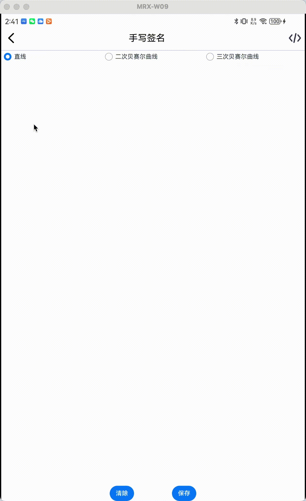
* 3D图片翻转  
  
* canvas 实现球面动画  
  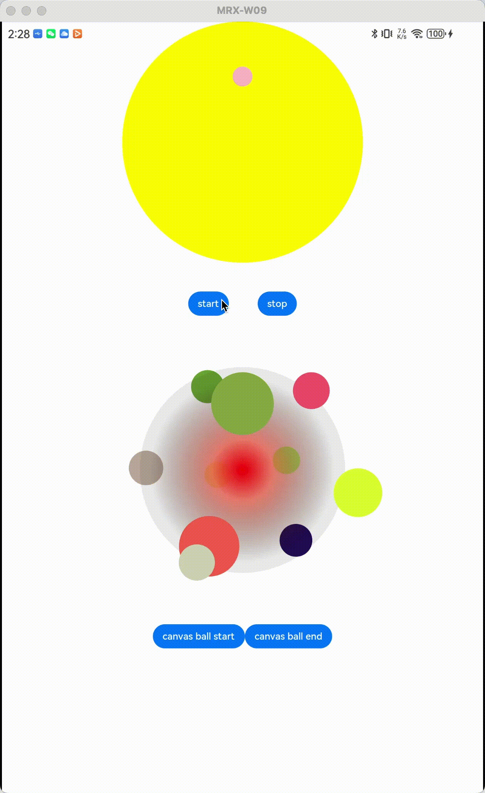
* canvas 一张图片分为九宫格展示  
  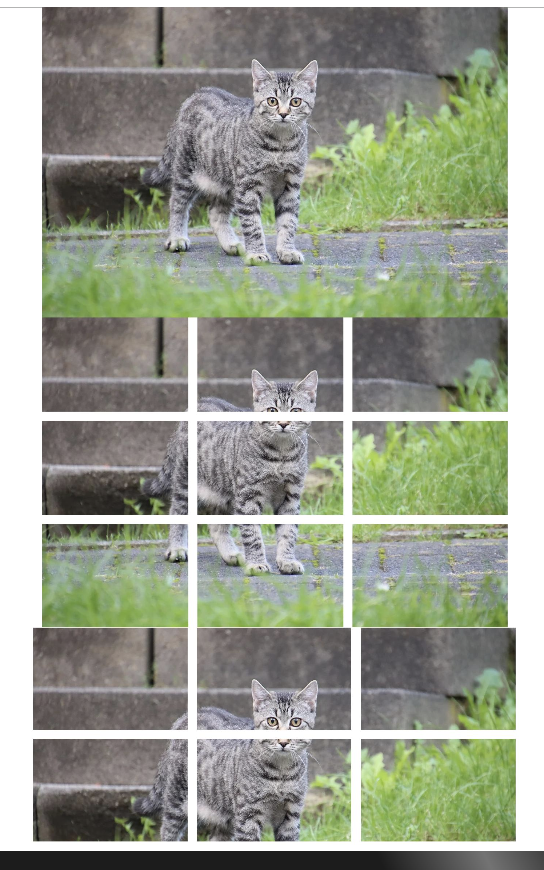
* canvas 使用贝塞尔曲线实现波浪效果  
  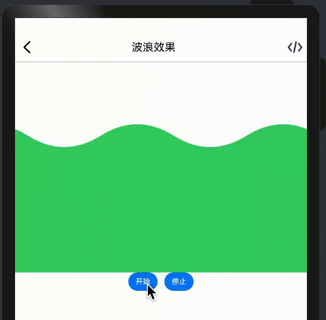
* canvas 刮刮乐  
  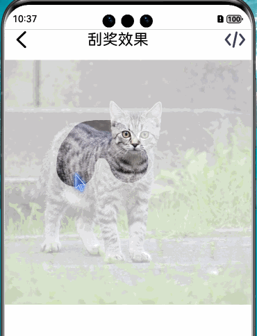  
* canvas 画时钟  
  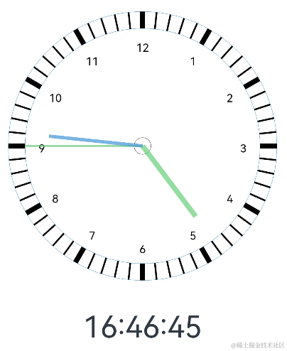  
* 富文本解析与渲染  
  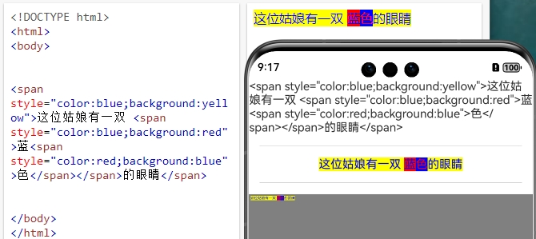  
* 可限制行数的Flex  
  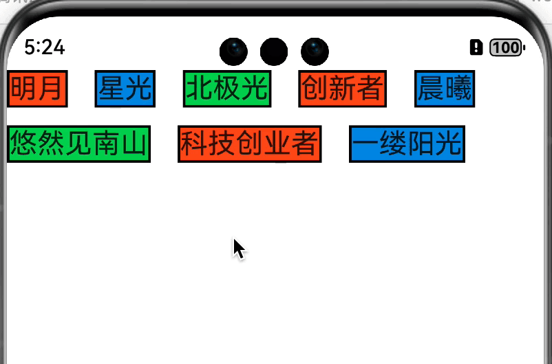  
* 验证码输入框  
    

      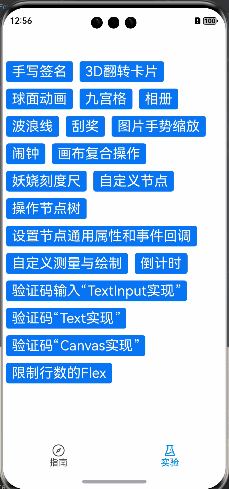
      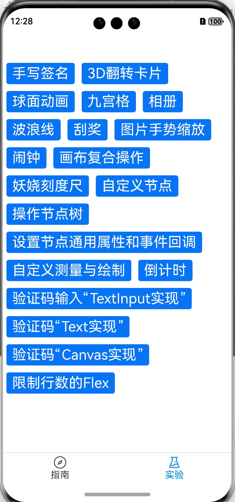
      
    

* 图片滑块验证码  
  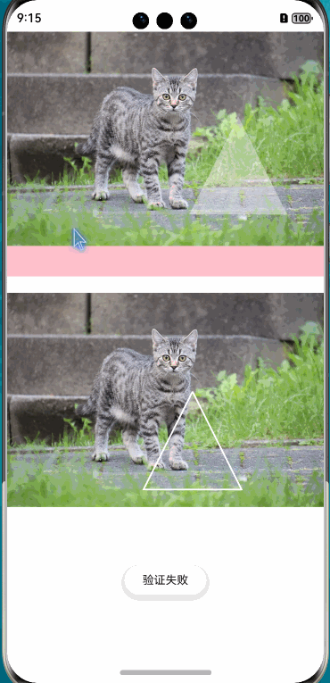  
* 自定义录像
